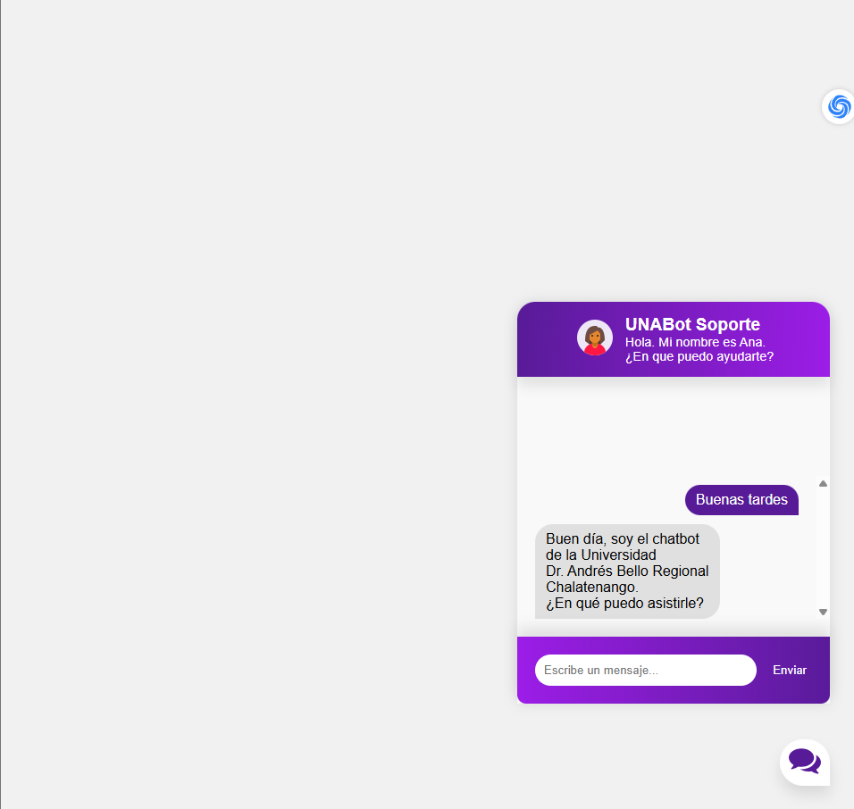
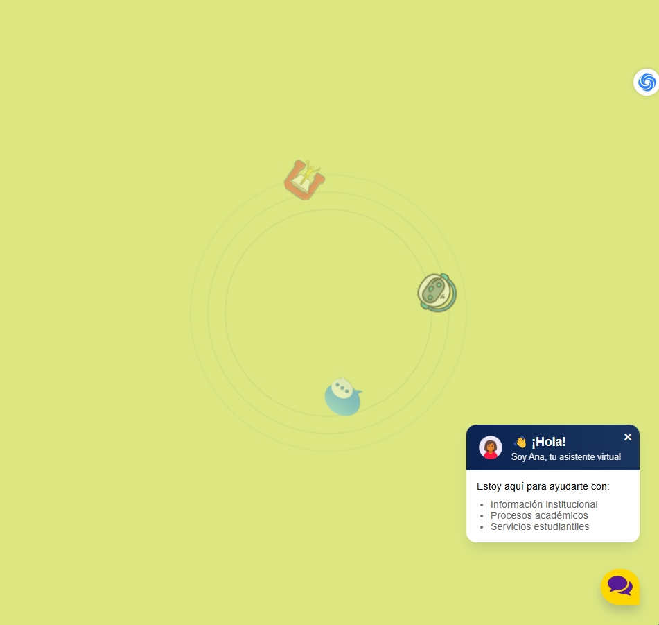
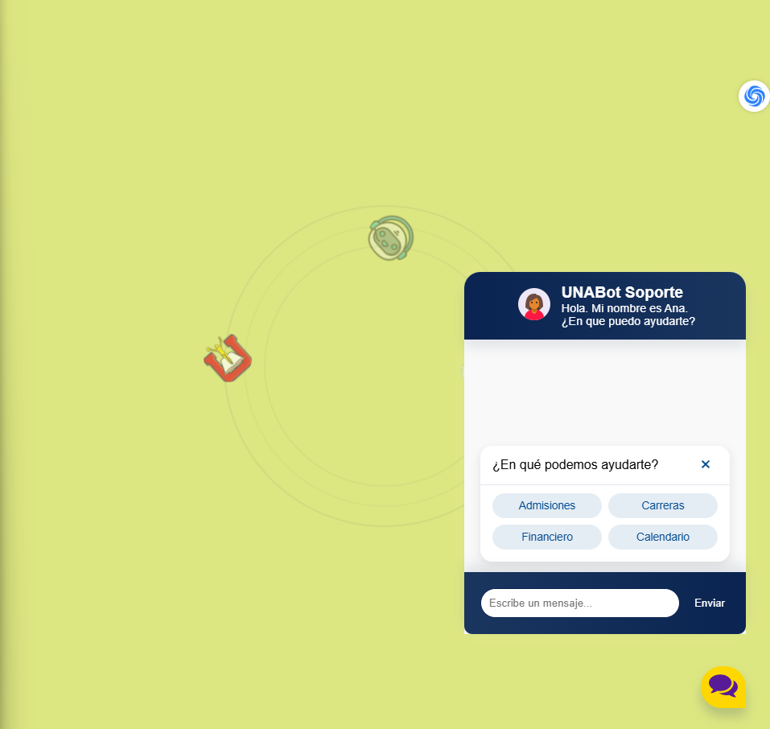

# UNABot 🎓+🤖 - Chat de Soporte
## Implementación con Flask y JavaScript.

Chatbot inteligente para la Universidad Dr. Andrés Bello (Regional Chalatenango), desarrollado para el procesamiento de lenguaje natural y Flask para la implementación web.



Cambios y mejoras en UNABot.



Actualización y mejoras en UNABot.



## Características Principales
- ✅ Modelo de IA entrenado con datos específicos de la universidad
- ✅ Interfaz web responsive con soporte para móviles
- ✅ Integración de enlaces clicables y formato HTML en respuestas
- ✅ Sistema de reconocimiento de intenciones en español
- ✅ Compatible con Windows, Linux y macOS

## 🔑 Configuración Inicial

## 📋 Requisitos previos
- Python 3.6 o superior
- pip (gestor de paquetes de Python)
- Git (opcional)

## 🚨 Instalación
### Clonar repositorio:
```bash
git clone https://github.com/tu-usuario/chatbot-unab.git
cd chatbot-unab
```
### Crear entorno virtual (Windows):

```bash
python -m venv venv
.\venv\Scripts\Activate.ps1
```
### Instalar dependencias:
```bash
pip install -r requirements.txt
pip install unidecode
```
### Descargar recursos de NLTK:
```bash
python -c "import nltk; nltk.download('punkt')"
```
## ▶️ Entrenamiento y Ejecución
#### 1-Modificar el archivo intents.json con tus preguntas y respuestas

#### 2-Entrenar el modelo:

```bash
python train.py
```
#### Ejecutar la aplicación (con soporte UTF-8):

```bash
python -X utf8 app.py
```
#### Abrir en navegador: http://localhost:5000

### 📂 Estructura del Proyecto
```bash
chatbot-unab/
├── static/          # Archivos estáticos (CSS, JS, imágenes)
├── templates/       # Plantillas HTML
├── intents.json     # Base de conocimiento del chatbot
├── train.py         # Script de entrenamiento
├── app.py           # Aplicación principal Flask
├── requirements.txt # Dependencias
└── README.md        # Documentación
```
